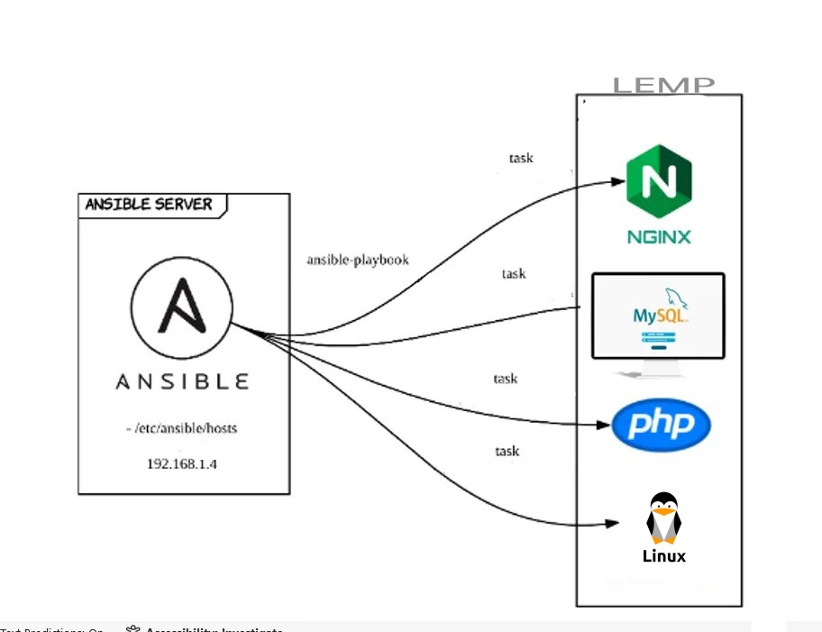

# Playbook that Installs and Configures Linux, Nginx, MySQL, and PHP.

<table>
  <tr>
    <td></td>
    <td>
      This repository provides configuration files to set up a basic **LEMP stack** (Linux, Nginx, MySQL, PHP) on an Ubuntu server.  
      It includes a sample Nginx site configuration and a PHP test file.
    </td>
  </tr>
</table>

---

## Running this Playbook

### Quick Steps

#### 1. Obtain the Playbook

```bash
git clone https://github.com/xrootms/lemp_ubuntu.git
cd lemp_ubuntu
```
#### 2. Run the Playbook

```bash
ansible-playbook nginx_site.yml
```
---

## Verification

After the playbook runs successfully:

1. Ensure Nginx is running:
   ```bash
   systemctl status nginx
   ```
2. Place your web root file `index.php` in (e.g., `/var/www/html/`).
3. Place your `Mysql root_password` and `Mysql DB user_passward`.
4. Visit your server in a browser:

   ```
   http://your-server-ip/
   ```

You should see the PHP test page.

---
